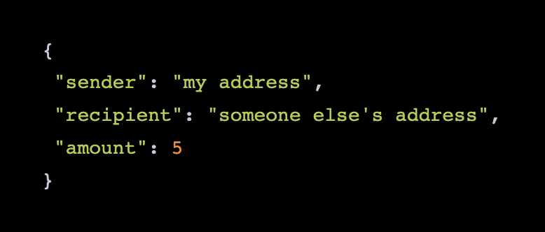

# Learning Blockchains by Bulding One

For my edification...  

## Overview of Blockchains
According to Investopedia: A blockchain is a digital database or ledger that is distributed among the nodes of a peer-to-peer network. Blocks are closed and linked to previously filled block, forming a new chain of data known as a blockchain. All new information that follows that freshly added block is compiled into a newly formed block that will then also be added to the chain once filled. Different types of information can be stored on a blockchain, but the most common use is as a ledger for transactions.

### Difference Between Database and Blockchain
Database holds its data in tables, blockchain holds data in blocks that are strung together. This makes blokchcains irreversible.

### Transaction Process

## Building the Blockchain

### Example of a Block

### Proof of Work
The algorithm used to verify the transaction and create a new block in the blockchain. Bitcoin uses SHA-256.
For this build:  
- Find a number p' such that hash(pp') contains leading 4 zeroes, where p is the previous proof
- p is the previous proof
- p' is the new proof

### BLockchain API
There will be 3 methods:
1. /transactions/new to create a new transaction to a block
2. /mine to tell our server to mine a new block
3. /chain to return the full Blockchain
Example request for a transaction:

### Consensus

